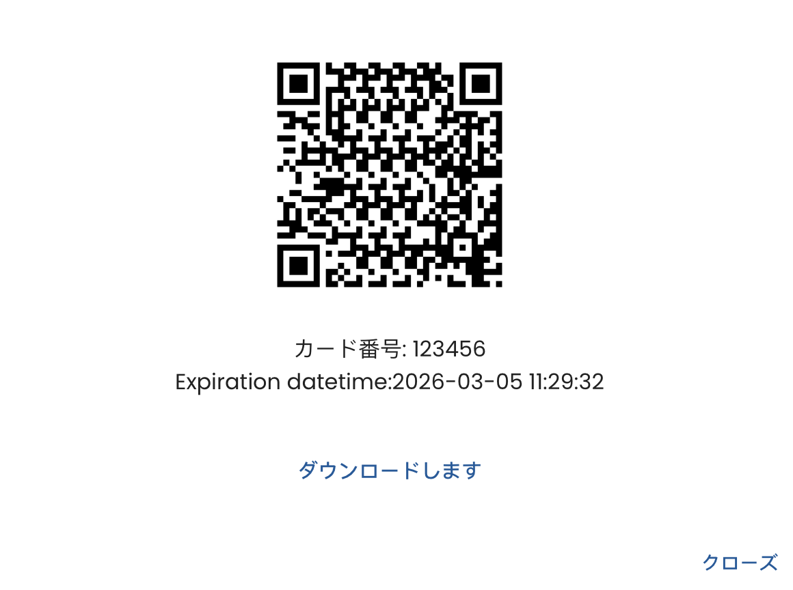
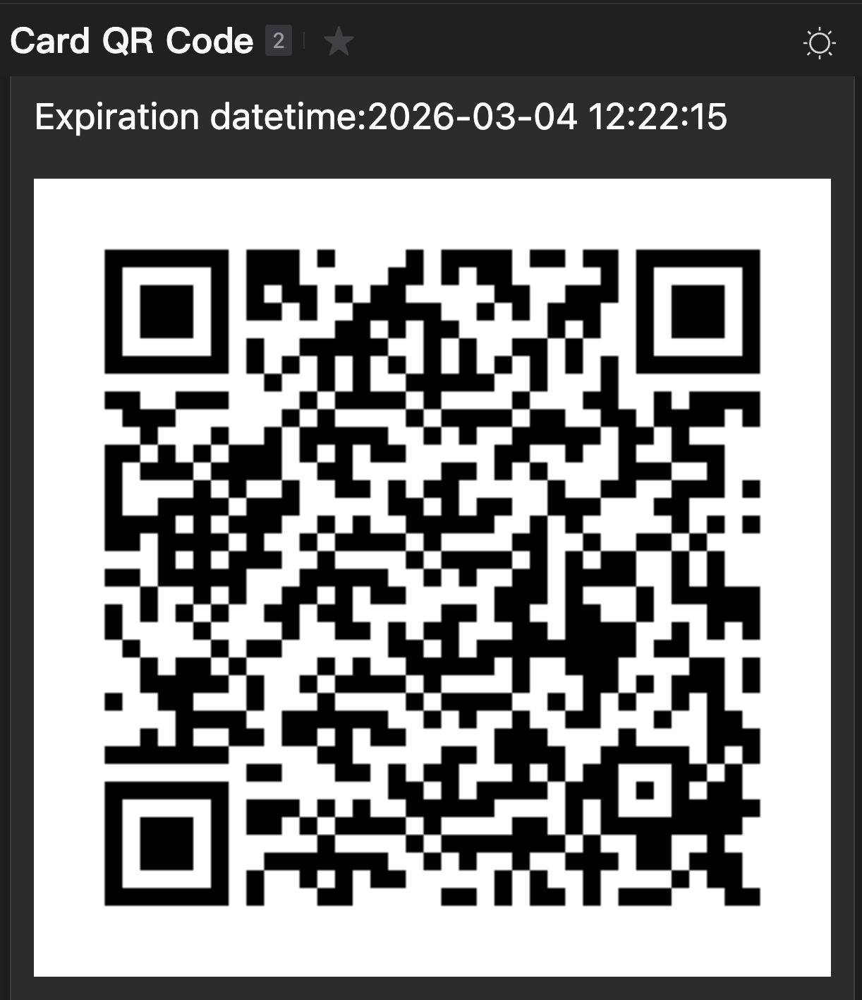

# ZKBioTimeJP

日本市場向けに最適化した、生体認証統合型の勤怠・簡易入退室管理プラットフォームです。  
厳格化する労務コンプライアンス対応と、現場運用の効率化を同時に実現します。

## 製品コンセプト

ZKBioTimeJPは、以下の課題を同時に解決することを目指して設計されています。

- 打刻データの真正性を高め、自己申告依存の運用リスクを低減したい
- 複数拠点・複数法人の勤怠を一元管理したい
- 勤怠、入退室、ワークフロー、データ連携を1つの基盤で運用したい
- 日本の労働関連法令に配慮した設定・運用を行いたい(一部開発中)

## 主な特長

### 1. 高精度な本人確認と、柔軟な打刻方式

- 生体認証対応: 顔認証、手のひら認証など
- 非生体認証対応: ICカード、パスワード
- 複合認証: 2要素認証、用途に応じた認証方式の組み合わせ
- なりすまし対策: ライブネス検知・不正利用防止
- 高速照合: 混雑時間帯でもスムーズな認証・通過（1s未満）

### 2. 日本の現場運用に合わせた勤怠機能

- 日本の祝日を反映した運用設定（休日カレンダー運用を効率化）
- 休憩時間の自動控除ルールに対応
- 残業管理・残業アラート
- 年次有給休暇の自動付与・自動計算
- 年5日年休取得義務を見据えた管理
- 36協定運用を見据えた残業時間管理
- 多様な勤務ルール: 固定、シフト、交替、フレックス
- パターンに基づくスケジュール自動生成

### 3. 申請・承認ワークフローの標準搭載

- 直行直帰、残業、休暇などの申請ワークフロー
- 承認履歴の保持による監査性の向上
- 申請から勤怠反映までのリードタイム短縮

### 4. 入退室管理との統合（簡易版）

- 勤怠端末と連携したドアアクセス制御
- 入退室ルールの配信・変更を効率化
- 権限に応じた遠隔解錠（例: 拠点責任者）

### 5. モバイル・QRを活用した現場拡張

- アプリ打刻（外勤・訪問先運用を含む）
- ジオフェンスによる位置条件付き運用
- QR通行コードの一括発行/個別発行
- 暗号化・有効期限付きQRで不正利用リスクを抑制

### 6. 従業員体験を高めるコミュニケーション機能

- 全社向け通知/個別メッセージ配信
- モバイルアプリだけでなく、端末認証時にもメッセージ表示
- 連絡周知の漏れを防止

### 7. 多拠点・多法人を見据えた運用基盤

- グローバル/国内複数拠点のデータ自動収集
- 拠点間の従業員データ同期
- マルチカンパニー運用（グループ企業管理）を想定した統合管理

### 8. 導入・運用負荷を下げる設計

- CSVによる従業員情報の一括登録
- 顔写真の一括取り込み
- 従業員スマートフォンによる顔情報セルフ登録
- 登録データの自動同期と照合テンプレート自動生成
- 新UIによる操作性向上
- 不要メニューを非表示化できる管理画面カスタマイズ

### 9. データ活用・システム連携（低コード）

- 多様な分析・管理レポート
- APIによる外部システム連携（人事/給与/ERP等）
- 定期自動エクスポート、マスタデータ連携
- ノーコード/低コードでの項目選択・フォーマット変換

## 活用シナリオ

### QR通行コードの活用

- 受付・イベント・会議・スクール・宿泊など、多用途の打刻且つ入退場（簡易）管理（ゲートの連動は可能）
- カード配布なしでの運用開始（必要に応じてICカード併用も可能）
- API連携により予約システムと接続し、自動発行フローを構築可能

#### ZKTeco QRの特長

- 暗号化されたQRのため、コード内容の解読や偽造が困難
- ユーザー情報と紐づいた発行で、運用上必要な属性を安全に取り扱い可能
- 有効期限を付与でき、利用時間帯を制御した運用に対応
- 動的QRとして都度発行でき、コピー・使い回しリスクを低減
- 読み取り速度は一般的なQRと同等で、現場オペレーションを阻害しない

#### ZKTeco QRと一般的な静的QRの比較

| 比較項目     | ZKTeco QR                                                | 一般的な静的QR                                         |
| ------------ | -------------------------------------------------------- | ------------------------------------------------------ |
| データ保護   | 暗号化されており、内容の解読・偽造が困難                 | 明文運用になりやすく、解読・改ざんリスクが高い         |
| ユーザー連携 | ユーザーと紐づけて発行でき、より多くの運用情報を保持可能 | コード単体での運用になりやすく、個人紐づけ情報が限定的 |
| 有効期限管理 | 開始/終了時刻を設定でき、シーン別に期限管理可能          | 発行後の期限統制が難しく、流出時のリスクが残りやすい   |
| 動的運用     | 動的更新・都度発行に対応し、複製対策を強化可能           | 静的コードの固定利用が中心で、コピー対策が限定的       |
| 読み取り速度 | 一般的なQRと同等の速度で読み取り可能                     | 標準的な読み取り速度                                   |

#### ZKTeco QRの発行方法（操作イメージ）

##### 1. 個別発行

- ユーザー単位でQRを個別発行できます。
- 発行したQRはダウンロードでき、Outlookなど任意のメールから相手先へ送付可能です。
- メール本文は用途に合わせて自由に作成できるため、来訪案内や参加案内の文面に柔軟に対応できます。\

※ここに「個別発行画面」のスクリーンショットを挿入してください。

##### 2. 一括メール送信

- 対象ユーザーを選択し、複数人へQRを一括送信できます。
- 全ユーザー一括送信はもちろん、1名のみ選択して送る運用にも対応します。
- 参加者が多い展示会・セミナー・イベント等で、短時間での配布が必要な場面に有効です。
- 各ユーザーに紐づいたメールアドレスへ送信できるため、配布ミスの抑制にもつながります。

※ここに「一括メール送信画面」のスクリーンショットを挿入してください。

### 作業区分による工数収集

- 工程A/工程Bなど作業別に時間を把握
- 工程管理・原価管理に使える実績データを蓄積

## 日本法令対応を見据えた設計（要点）

> 以下は、2026年3月4日時点で公開されている官公庁情報をもとにした整理です。

| 主な論点                       | 公開情報の要点                                                                                       | ZKBioTimeJPでの運用ポイント                                                  |
| ------------------------------ | ---------------------------------------------------------------------------------------------------- | ---------------------------------------------------------------------------- |
| 労働時間の客観的把握           | 使用者には労働時間を適正に把握する責務があり、始業・終業時刻は客観的記録を基礎に確認・記録することが示されています。 | 生体認証/IC/アプリ等の打刻ログを統合し、客観的データ中心の運用を支援。       |
| 時間外労働の上限規制（36協定） | 残業上限は原則 月45時間・年360時間。特別条項でも年720時間、複数月平均80時間以内、月100時間未満（休日労働含む）等が必要。 | 残業集計、アラート、レポートで上限超過リスクを早期把握。                     |
| 休憩付与                       | 6時間超で45分以上、8時間超で1時間以上の休憩付与が必要。                                              | 勤務パターンごとの休憩控除ルールを設定し、運用標準化を支援。                 |
| 年次有給休暇（年5日）          | 年10日以上の年休が付与される労働者に対し、毎年5日取得させることが必要。                              | 自動付与・取得進捗可視化・不足アラートで管理負荷を軽減。                     |
| 労働関係書類の保存期間         | 労働関係書類は5年へ延長。経過措置として「当分の間」3年とする扱いが示されています。                   | 勤怠・申請・承認履歴を継続保管し、監査や証跡確認に対応しやすい運用を支援。   |
| 生体情報と個人情報保護         | 顔特徴等の生体関連情報は個人情報/個人識別符号に該当し得るため、利用目的の特定・通知/公表、安全管理等が重要。 | 目的別運用設計、権限分離、アクセス制御、監査ログ運用を通じて統制強化を支援。 |

## 法令理解に役立つ参考図（公的サイト掲載画像）

### 時間外労働の上限規制（改正後イメージ）

### 年5日年休取得義務の考え方（例）

## 参考情報（公式）

- 厚生労働省: 労働基準法の基礎知識（令和7年12月版）  
  https://www.mhlw.go.jp/content/11200000/001604439.pdf
- 厚生労働省: 時間外労働の上限規制  
  https://hatarakikatakaikaku.mhlw.go.jp/overtime.html
- 厚生労働省: 年次有給休暇の時季指定  
  https://hatarakikatakaikaku.mhlw.go.jp/salaried.html
- 厚生労働省: 労働時間の適正な把握ガイドライン（平成29年1月20日策定）  
  https://www.mhlw.go.jp/stf/seisakunitsuite/bunya/koyou_roudou/roudoukijun/roudouzikan/070614-2.html
- 厚生労働省: 労働関係書類の保管期間Q&A（スタートアップ労働条件）  
  https://www.startup-roudou.mhlw.go.jp/qa/zigyonushi/syuugyoukisoku/q6.html
- 個人情報保護委員会: 個人情報保護法ガイドライン（通則編）  
  https://www.ppc.go.jp/personalinfo/legal/guidelines_tsusoku/
- 個人情報保護委員会: ガイドラインQ&A（顔識別機能付きカメラ等）  
  https://www.ppc.go.jp/personalinfo/faq/APPI_QA/

## ご提案

ZKBioTimeJPは、単なる打刻システムではなく、  
**「真正性の高い勤怠データ」×「法令対応を見据えた運用」×「現場の使いやすさ」** を一体で提供する日本市場向けソリューションです。

追記：現在、日本の労働法規が変更されているため、導入前にご自身のニーズに合っているかをご確認ください。

導入時は、お客様の就業規則・36協定・申請承認フローに合わせて、最適な設定テンプレートをご提案します。

---

※本READMEは製品紹介資料です。個別案件における法令解釈・適法性判断は、所管官庁資料や社会保険労務士等の専門家確認を推奨します。